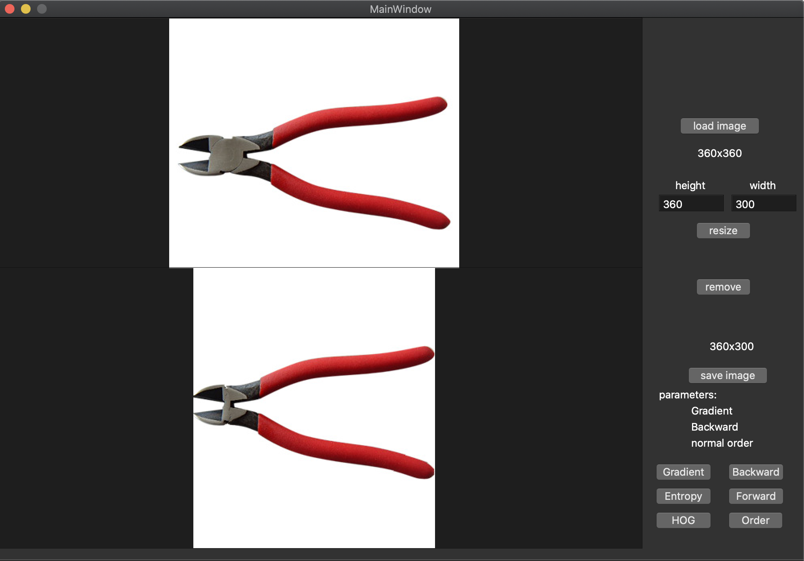
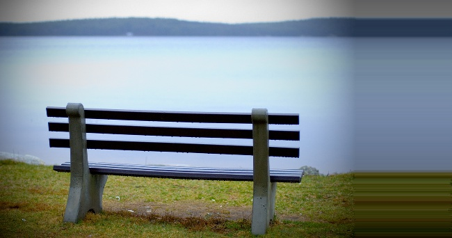
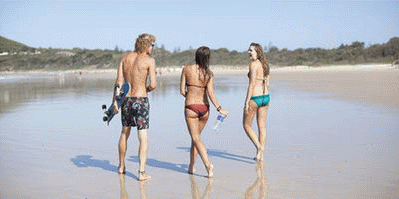
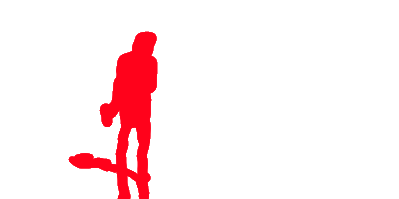
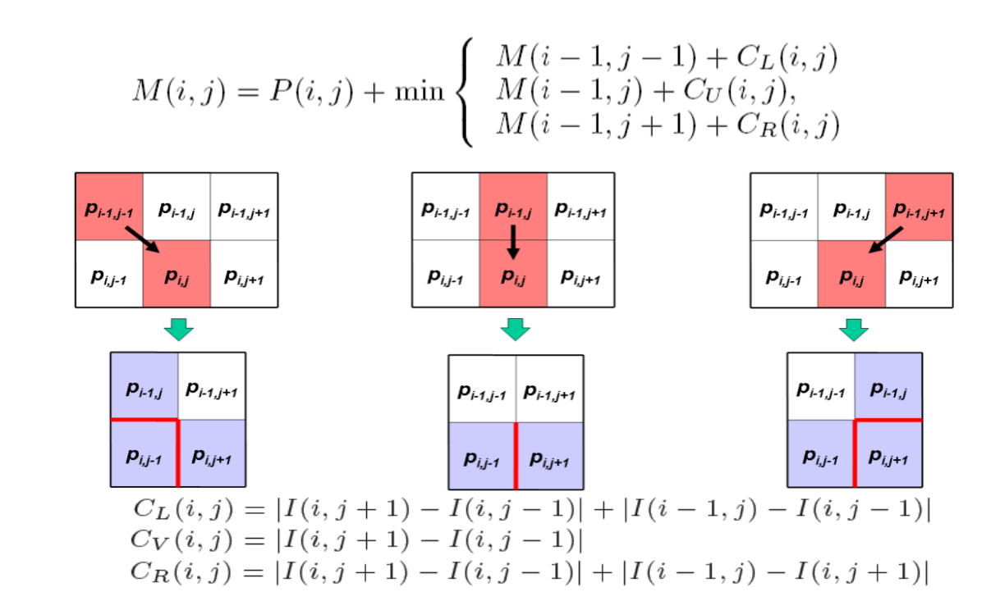
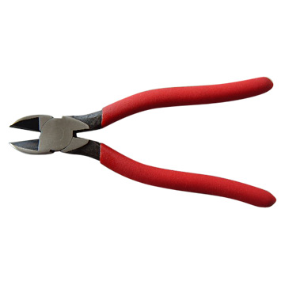
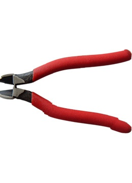
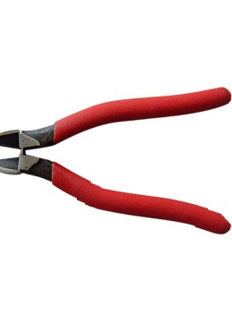

# 媒体计算Seam Carving作业报告

2017011305 安頔

---

[TOC]

### 一、项目说明

#### 1、采分点

- 实现基本算法，可以支持水平或者垂直缩小
- 实现论文中Gradient，Entropy，HOG三种不同的能量函数
- 实现水平或者垂直的放大，具体实现方法是分阶段迭代
- 实现基于mask的目标保护/移除（硬约束）
- 实现动态规划优化水平和垂直缩小时的删除顺序
- 实现前向能量公式
- 实现简单的GUI，支持以上所有的功能

#### 2、项目结构说明

​	环境配置：

```
opencv >= 4.5.0
qmake >= 3.1
C++11
```

​	主要代码文件有：

|           代码文件            |         功能         |
| :---------------------------: | :------------------: |
|  SeamCarve.h & SeamCarve.cpp  | 实现图像智能缩放功能 |
| mainwindow.h & mainwindow.cpp |   实现GUI交互功能    |
|           main.cpp            |       启动GUI        |

使用Qt Creator打开seam_carve_qt.pro项目文件，配置opencv库，具体配置方法在seam_carve_qt.pro里找到如下内容：

```python
INCLUDEPATH += /usr/local/Cellar/opencv/4.5.0_5/include/opencv4/opencv2/
INCLUDEPATH += /usr/local/Cellar/opencv/4.5.0_5/include/
INCLUDEPATH += /usr/local/Cellar/opencv/4.5.0_5/include/opencv4/
LIBS += -L/usr/local/Cellar/opencv/4.5.0_5/lib/ -lopencv_core -lopencv_highgui -lopencv_imgproc -lopencv_imgcodecs
```

将路径修改为自己本地opencv库的路径，然后编译运行即可。

运行时的交互界面如下：



其中各个button的功能如下：

|  按钮名称  |                        按钮功能                        |
| :--------: | :----------------------------------------------------: |
| load image |             选择加载图片的路径并显示在上方             |
|   resize   |     将图片缩放到输入的height*width大小并显示在下方     |
|   remove   | 选择目标移除的mask的路径加载，进行目标移除并显示在下方 |
| save image |               选择路径保存下方显示的图片               |
|  Gradient  |                 切换能量函数为Gradient                 |
|  Entropy   |                 切换能量函数为Entropy                  |
|    HOG     |                   切换能量函数为HOG                    |
|  Backward  |                   不采用前向能量公式                   |
|  Forward   |                    采用前向能量公式                    |
|   Order    |                   切换删缝顺序的策略                   |

Parameters里三行依次表示

- 当前使用的能量函数（具体公式见算法思路章节）
- 当前采用Backward能量公式或是Forward能量公式
- 当前采用的删缝顺序策略，normal order表示先处理水平缩放再处理垂直缩放，optimal order表示使用动态规划优化删缝顺序

在SeamCarve.h和SeamCarve.cpp里，没有使用任何Qt相关的第三方库。如果本地环境没有Qt，可以把SeamCarve类单独拿出来使用，采用cmake或者make编译运行即可。

data文件夹中是测试用的图片，result文件夹是得到的结果，这些图片会在报告中依次进行展示来对比说明每个功能的实现效果。

### 二、算法思路及效果

#### 1、水平或垂直缩小的基本算法

​	定义Gradient能量函数为：
$$
e_{Grad}(I) = |\frac{\part I}{\part x}|+|\frac{\part I}{\part y}|
$$
​	以水平缩小为例，利用动态规划求解从上到下的最小能量细缝，状态转移方程可以表示为
$$
M(i, j) = e_{Grad}(I(i, j))+min\{M(i-1, j-1), M(i, j-1), M(i+1, j-1)\}
$$
​	过程中记录转移来的方向，回溯的时候删除这些点，这样使得图像水平方向的大小减少了1，迭代以上算法直到缩小到期望的尺寸即可。

​	对于垂直缩小，不需要重新写状态转移方程，只需要将图像转置之后进行水平缩小，然后再转置回来即可。

​	具体缩小效果可以参见下面三种能量函数的对比图。

#### 2、Gradient，Entropy，HOG三种不同的能量函数

​	定义Gradient能量函数如下：
$$
e_{Grad}(I) = |\frac{\part I}{\part x}|+|\frac{\part I}{\part y}|\\
$$
​	定义Entropy能量函数如下：
$$
p_{color}(I) = \Sigma_{pixel\in window(I)}[pixel == color]\\
Entropy(I) = \Sigma_{i=0}^{255}-p_{color}(I)log_2(p_{color}(I))\\
e_{Entropy}(I) = e_{Grad}(I)+Entropy(I)
$$
​	其中$window(I)$表示以$I$为中心的size*size的窗口，实际代码中size = 9，$Entropy(I)$本质上是$window(I)$区域里的熵。

​	定义HOG能量函数如下：
$$
angle(I) = tan^{-1}(\frac{\part y}{\part x})\\
HOG(I, i) = \Sigma_{pixel\in window(I)}[2\pi i/bin \leq angle(pixel) < 2\pi (i+1)/bin]\\
e_{HOG}(I) = \frac{e_{Grad}(I)}{max_{i = 0}^{(bin-1)}\{HOG(I, i)\}}
$$
​	其中$angle(I)$表示$I$对应的方向梯度，角度取值$[0, 2\pi)$，$HOG(I, i)$表示将$[0, 2\pi)$的角度分成$bin$份，对$window(I)$里面的像素点进行方向梯度直方图统计，在直方图中取值最大的作为分母，Gradient能量函数作为分子，可以得到HOG能量函数。实际代码中bin=8, size = 11​

​	对于以下$533*800$的图像，使用三种不同能量函数分别缩小到$533*600$。

<div STYLE="page-break-after: always;"></div>

​	原图像：


<div STYLE="page-break-after: always;"></div>

Gradient能量函数：


<div STYLE="page-break-after: always;"></div>

Entropy能量函数：


<div STYLE="page-break-after: always;"></div>

HOG能量函数：


​	对比可以看出来，对于这幅图的缩小，Entropy能量函数的效果较好，HOG和Gradient能量函数缩小的效果相似。

​	论文中提到各种能量函数对于不同的图像表现是不同的，通常情况下，Gradient和HOG能量函数的效果就已经非常不错了。

#### 3、分阶段迭代垂直或者水平的放大

​	放大和缩小的原理是相似的，找到能量较小的细缝，然后在细缝的左边扩充像素，新像素的颜色是左右两个像素的颜色的中值。但是按照这种扩充方法，原来选择的能量较小的细缝在扩充后能量会更小，下次迭代的时候还是会选择到这条细缝，这样会把图像的一条细缝重复很多次，导致如下结果：

​	原图像：


  错误的放大结果为：



​	因此参考论文的实现方式，放大需要分阶段进行迭代。实际代码实现中将扩大分成了两个阶段，每个阶段选取要能量前k低的细缝，这些细缝互不相交，k的取值是需要扩大的尺寸的一半。这样可以有效避免图像放大的时候重复的问题。

​	这样实现的放大结果为：


#### 4、实现基于mask的目标保护/移除

​	这部分功能需要给出一个mask图像表示目标，其中要保护/移除的目标的RGB不为(0, 0, 0)。对于要保护的目标，可以视为对应的像素的能量函数值为inf(无穷大)；对于要移除的目标，可以视为对应的像素的能量函数值为-inf(无穷大)，然后按照之前的算法进行图像缩放即可。

​	以目标移除为例，对于以下的图像：



​	mask为：



​	即需要移除图像中的男人部分，目标移除共分为两阶段，第一阶段先是通过图像缩小将男人部分所有的像素删除掉，然后再通过图像放大复原回原来图像的大小。

​	图像缩小后的移除结果如下：


​	之后放大回原图像的大小：


​	可以发现图像中的男人部分被成功移除。

#### 5、实现动态规划优化水平和垂直缩小时的删除顺序

​	当水平方向和垂直方向都需要缩小的时候，缩小的顺序也是可以优化的。论文中提到状态转移方程为
$$
T(r, c) = min(T(r-1, c)+E(s^{x}(I_{n-r+1,m-c}), T(r, c-1)+E(s^{y}(I_{n-r,m-c+1}))))
$$
​	其中$T(r,c)$表示水平删除r条细缝，垂直删除c条细缝的最小代价，$E$表示删除细缝的代价。

​	这个动态规划算法是非完美算法，因为这是具有后效性的状态转移式子，对于同一个$(r,c)$，使用不同的顺序可以得到不同的$T(r,c)$，也会得到不同的图像，而不同的图像这一因素在式子中没有考虑，但是它会影响到后面的$E$的计算。

​	设图像高度为$h$，宽度为$w$，那么这样动态规划的时间复杂度为$O(r*c*h*w)$，是非常高的。实际代码实现的时候，将水平或者垂直缩小5条细缝看成一组，动态规划的时候计算每组缩小的顺序，这样对原算法进行了加速，可以快速得到结果。

​	原图像：


​	先水平后垂直缩小的结果：


​	优化删缝顺序的结果：


​	可以看出对删缝顺序的优化对于图像尤其是背景的效果上略有提升，但是相比付出的时间和空间代价，提升的效果非常有限。

#### 6、实现前向能量公式

​	前向能量公式的核心思想是考虑删除细缝之后产生的新的图像梯度值，具体情况参考以下课件：



​	在状态转移的时候计算$C_L,C_V,C_R$即可，加入这一项可以使得缩放后的图像更加平滑。

​	原图像：



不加入前向能量项的结果：



加入前向能量项的结果：



对比两个钳子缩小后的效果，加入前向能量项的图像在钳子的把手上更加的平滑自然。


#### 7、实现GUI，支持以上所有功能

​	GUI是基于Qt实现的，交互界面可以参见报告第一章第二小节，集成了以上实现的所有功能。


​	使用时先用load image加载原图像，可以输入height和width进行resize操作（这里因为前端显示需求，要求height和width均小于1024，且大于100），也可以remove加载mask进行目标移除，得到的图像结果显示在下面。注意，所有的操作都是针对于load image加载的图像为基础做的。

​	之后可以使用save image保存下方显示的图片。右下角表示seam carving的参数，包括能量函数，是否加入前向能量项，是否优化删缝顺序。


### 三、一些补充 & 总结

​	seam carving是一个非常有意思的算法。在实现过程中，由于Entropy和HOG能量函数都涉及到了滑动窗口，如果暴力计算的话，常数很大，导致程序需要运行很久。因此实验中对滑动窗口的计算进行了优化，利用了上次滑动窗口的计算结果，只考虑滑动窗口在滑动过程中减少的像素点和增加的像素点，从而有效减少了程序常数，以上图片除了优化删缝顺序那一节以外，其他图像都可以在15s内计算完成。

​	扩展算法中，分阶段放大图像和前向能量公式都是非常有效且直观的优化，目标移除/保护也是很有趣的应用。但是对于删缝顺序的优化，我认为这个动态规划的算法是非完美的，正确性无法证明，同时这个优化明显增加了时间和空间复杂度，尽管相比优化前有一定的改进，但是改进并不明显。

​	这个学期媒体计算的课程上下来，可以发现SIGGRAPH在2000年到2013年的关于图像的工作，都是可解释性非常强的，易于理解的。复现过程中，感觉更像是在做算法题，思路也很是巧妙，有很多值得现在的工作参考的一些idea。希望媒体计算这门课能够越讲越好！

​	感谢老师的讲解和助教的评阅！

